# CodeAlpha Car Price Prediction

Predicting the selling price of used vehicles with machine-learning **regression** models.
Task 3 of the **CodeAlpha Virtual Data Science Internship**.

---

## 1. Project Overview

This project takes a real-world dataset of used-vehicle listings and builds a complete beginner-friendly machine-learning workflow:
data inspection → cleaning → feature engineering → EDA → preprocessing → training 5 regression models → evaluation → cross-validation → interpretation → sample prediction.

Everything in this README (numbers and charts) is produced by running `src/car_price_prediction.py` on the dataset in `data/`.

## 2. Objective

Build and compare regression models that predict `Selling_Price` from vehicle details (present price, age, kilometres driven, fuel type, transmission, seller type and number of previous owners), and understand how reliable those predictions are.

## 3. Dataset

- File: `data/car data.csv` (the dataset provided for the task)
- Size: **301 rows × 9 columns** (299 rows after removing 2 duplicate rows)
- Missing values: **0**
- Year range: **2003 – 2018**
- Target column: `Selling_Price`
- Price units are **not stated** in the CSV (they look like lakhs of Indian rupees, but this was not verified), so this project reports prices in "dataset units".
- Important discovery: although the file is called *car data*, judging by the names it contains **200 cars and 101 motorcycles/scooters** (e.g. Royal Enfield, Activa, Bajaj).

## 4. Dataset Features

| Column | Type | Description |
|---|---|---|
| `Car_Name` | Categorical | Vehicle name (98 unique values in the raw file) – **not used** as a model input |
| `Year` | Numeric | Year of the vehicle (replaced by `Car_Age`) |
| `Selling_Price` | Numeric | **Target** – the selling price recorded for the vehicle |
| `Present_Price` | Numeric | Present price of the vehicle (usually read as the current showroom price; the file does not define it) |
| `Driven_kms` | Numeric | Kilometres driven |
| `Fuel_Type` | Categorical | Petrol / Diesel / CNG |
| `Selling_type` | Categorical | Dealer / Individual |
| `Transmission` | Categorical | Manual / Automatic |
| `Owner` | Numeric | Number of previous owners (values 0, 1 and 3 appear) |
| `Car_Age` | Numeric | **Engineered** – `2018 − Year` |

## 5. Technologies Used

Python 3, pandas, NumPy, Matplotlib, Seaborn, scikit-learn (developed and tested with Python 3.12, pandas 3.0, scikit-learn 1.8).

## 6. Project Structure

```
CodeAlpha_Car_Price_Prediction/
├── data/
│   └── car data.csv
├── outputs/
│   ├── images/                 # 12 charts (PNG)
│   ├── model_comparison.csv    # CV + test metrics for all models
│   └── results.txt             # full log of the actual run
├── src/
│   └── car_price_prediction.py # the whole project
├── README.md
├── requirements.txt
└── .gitignore
```

## 7. Data Cleaning

| Check | Result | Decision |
|---|---|---|
| Missing values | 0 | No imputation needed |
| Column names / text | Extra spaces (e.g. `Bajaj  ct 100`) | Stripped spaces (98 → 97 unique names) |
| Duplicate rows | 2 (`ertiga` 2016 and `fortuner` 2015, identical in all 9 columns) | **Removed** – they look like accidental double entries, and duplicates could appear in both train and test sets and inflate scores |
| Impossible values | None (no zero/negative prices or kms; selling price never above present price) | Nothing removed |
| Extreme values | One vehicle with 500,000 km (an Activa scooter) and one with Present_Price 92.6 | **Kept** – unusual but not impossible; noted as limitation |
| Target type | `Selling_Price` is numeric | No change |

## 8. Feature Engineering

- **`Car_Age = 2018 − Year`.** The reference year 2018 is the newest year in the dataset. Using today's year (2026) would only add a constant to every age and would not suit a historical dataset.
- `Year` is dropped from the inputs because it contains exactly the same information as `Car_Age`.
- `Car_Name` is not used: it has about 98 different values for fewer than 300 rows, so one-hot encoding would create many almost-empty columns and encourage overfitting.

## 9. Exploratory Data Analysis

Main facts from the actual data (after cleaning):

- `Selling_Price` is **right-skewed**: most listings are cheap and a few are expensive.
- `Present_Price` and `Selling_Price` are strongly related (Pearson r = 0.876, Spearman ρ = 0.907).
- `Car_Age` has a weak negative correlation with price (r = -0.234); `Driven_kms` has almost none (r = 0.029).
- Diesel and Automatic vehicles have higher median prices, but Automatic (39 rows) and CNG (2 rows) are small groups.
- `Selling_type` is closely tied to vehicle type here: 101 of the 106 "Individual" listings are motorcycles/scooters, while all 193 "Dealer" listings are cars. The price gap between Dealer and Individual therefore **should not** be read as a pure selling-channel effect.

## 10. Machine Learning Approach

1. **Split first:** 80% training (239 rows) / 20% testing (60 rows), `random_state = 42`.
2. **Preprocessing inside a Pipeline:** `StandardScaler` for numeric columns and `OneHotEncoder` for categorical columns, wrapped in a `ColumnTransformer`. Because it lives inside each Pipeline, it is *fitted only on training data* (and only on the training part of each cross-validation fold), which prevents data leakage.
3. **Cross-validation on the training set only** (5-fold) to compare the models.
4. **Model selection by cross-validation** – decided *before* looking at test results.
5. **Final evaluation on the untouched test set** with MAE, RMSE and R².

**Training data** is what the model learns from; **test data** is kept hidden to measure how it performs on vehicles it has never seen.

## 11. Models Compared

Linear Regression, Decision Tree, Random Forest (200 trees), Gradient Boosting, K-Nearest Neighbors (k = 5). All use default settings (with a fixed `random_state`); no hyperparameter tuning was done.

## 12. Evaluation Metrics

| Metric | Meaning in simple words | Better is |
|---|---|---|
| **MAE** | Average size of the prediction error, in price units | Lower |
| **RMSE** | Like MAE but punishes large mistakes more heavily | Lower |
| **R²** | Share of the price variation the model explains (1.0 = perfect, 0 = no better than always guessing the average) | Higher |

## 13. Cross-Validation

5-fold cross-validation splits the training data into 5 parts; each part is used once as a mini-test while the other 4 train the model. It gives a more stable estimate than a single split, and the standard deviation shows how much the score changes between folds. The test set was **not** used here.

| Model | CV R² (mean ± std) | CV RMSE (mean ± std) | CV MAE (mean) |
|---|---|---|---|
| Linear Regression | 0.8846 ± 0.0288 | 1.6479 ± 0.4387 | 1.1035 |
| Decision Tree | 0.8945 ± 0.0647 | 1.5912 ± 0.8204 | 0.7664 |
| Random Forest | 0.8921 ± 0.0881 | 1.5202 ± 0.9372 | 0.6773 |
| Gradient Boosting | 0.8829 ± 0.1099 | 1.5925 ± 1.1239 | 0.7066 |
| KNN | 0.8898 ± 0.0641 | 1.6085 ± 0.8065 | 0.9305 |

The five models' mean CV R² values lie within **0.0116** of each other, which is much smaller than the fold-to-fold standard deviation. Cross-validation therefore **cannot clearly separate these models** – it is close to a tie.

## 14. Model Results

Test-set results (60 vehicles the models never saw):

| Model | MAE | RMSE | R2 |
|---|---|---|---|
| Linear Regression | 1.4725 | 2.5245 | 0.7527 |
| Decision Tree | 1.4337 | 3.0558 | 0.6377 |
| Random Forest | 1.5476 | 3.7566 | 0.4525 |
| Gradient Boosting | 1.2365 | 2.8517 | 0.6845 |
| KNN | 1.1019 | 2.0129 | 0.8428 |

(`outputs/model_comparison.csv` also contains the CV numbers and training R².)

Things to notice:
- All models score lower on the test set than in cross-validation (test R² ranges from 0.45 to 0.84).
- Decision Tree, Random Forest and Gradient Boosting reach training R² ≥ 0.98 (Decision Tree: 1.00) – they largely memorise the training data.
- On this particular test split **KNN** scored best, but with only 60 test rows and a few unusual vehicles, the *test ranking is not very reliable*.

## 15. Final Model

**Selected model: Decision Tree**

Selection rule (fixed before looking at the test set): highest mean cross-validation R² on the training data, with lower CV RMSE as tie-breaker. Decision Tree had the highest mean CV R² (0.8945 ± 0.0647).

Its test performance: **MAE = 1.4337, RMSE = 3.0558, R² = 0.6377**.

Honest note: the CV margin over the other models is tiny, and Decision Tree has training R² of 1.00, meaning it overfits. The test set was deliberately *not* used to change the choice, since that would leak test information into model selection. The two largest test errors (a 2006 Camry with 3 previous owners and a 2008 Corolla Altis, both predicted far too high) account for 52% of the final model's squared test error.

Feature importance (built-in, Decision Tree): `Present_Price` ≈ 0.91 and `Car_Age` ≈ 0.08 of the total importance. Permutation importance on the test set agrees on the ranking of these two. This shows what the model *relies on*, not what *causes* prices.

## 16. Sample Prediction

These are **model predictions**, not guaranteed market prices.

| Input | Sample 1 (typical vehicle) | Sample 2 (newer premium diesel) |
|---|---|---|
| Present_Price | 6.1 | 20.0 |
| Driven_kms | 32,000 | 40,000 |
| Car_Age | 4 (Year 2014) | 2 (Year 2016) |
| Owner | 0 | 0 |
| Fuel_Type | Petrol | Diesel |
| Selling_type | Dealer | Dealer |
| Transmission | Manual | Automatic |
| **Predicted Selling_Price** | **5.40** | **14.25** |

Sample 1 uses the dataset's median values / most common categories; both samples stay inside the ranges seen in the data.

## 17. Visualizations

| | |
|---|---|
| 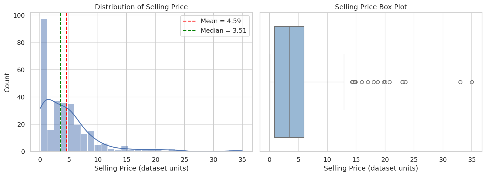 | 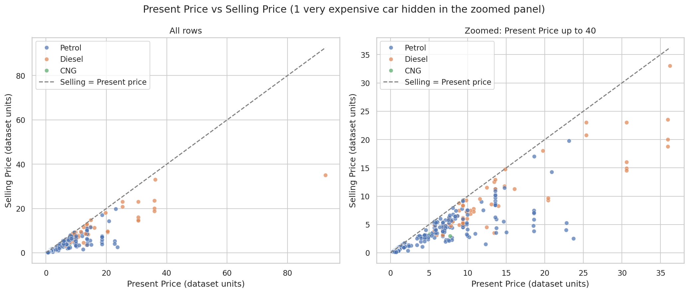 |
| 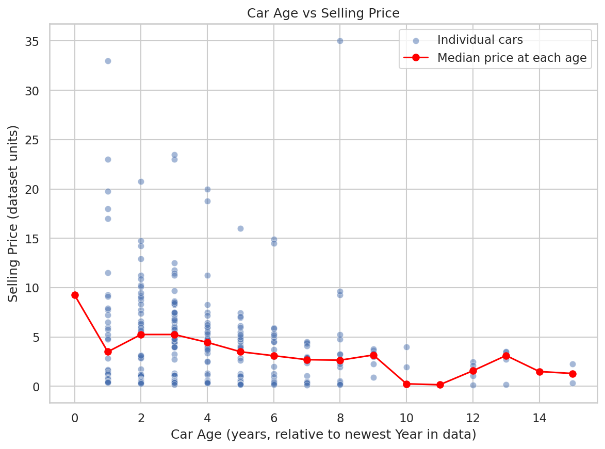 | 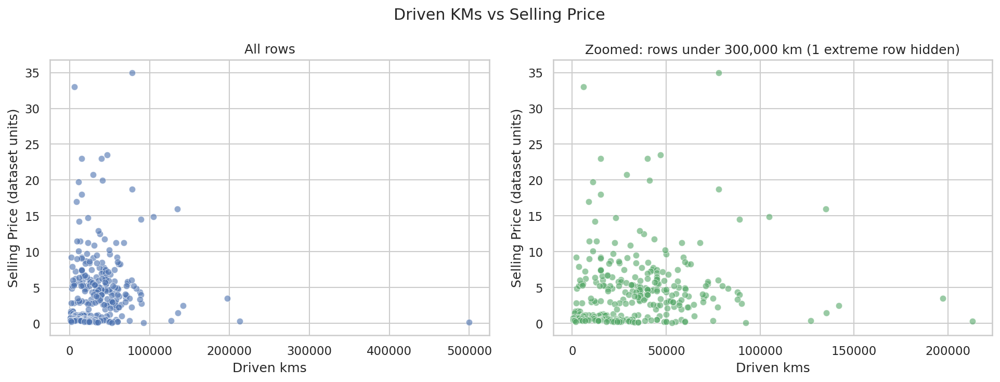 |
| 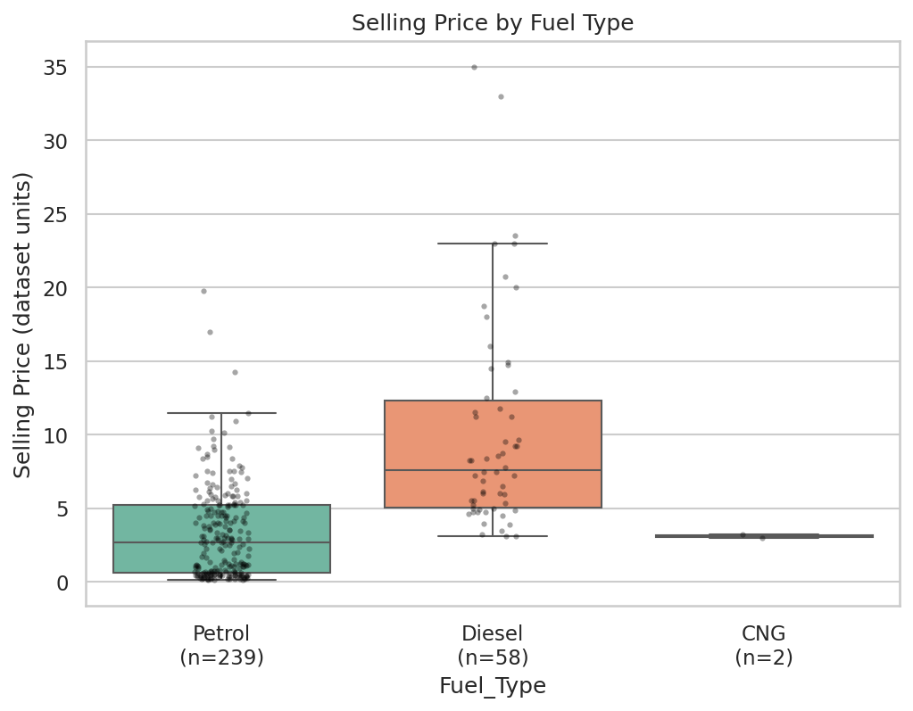 | 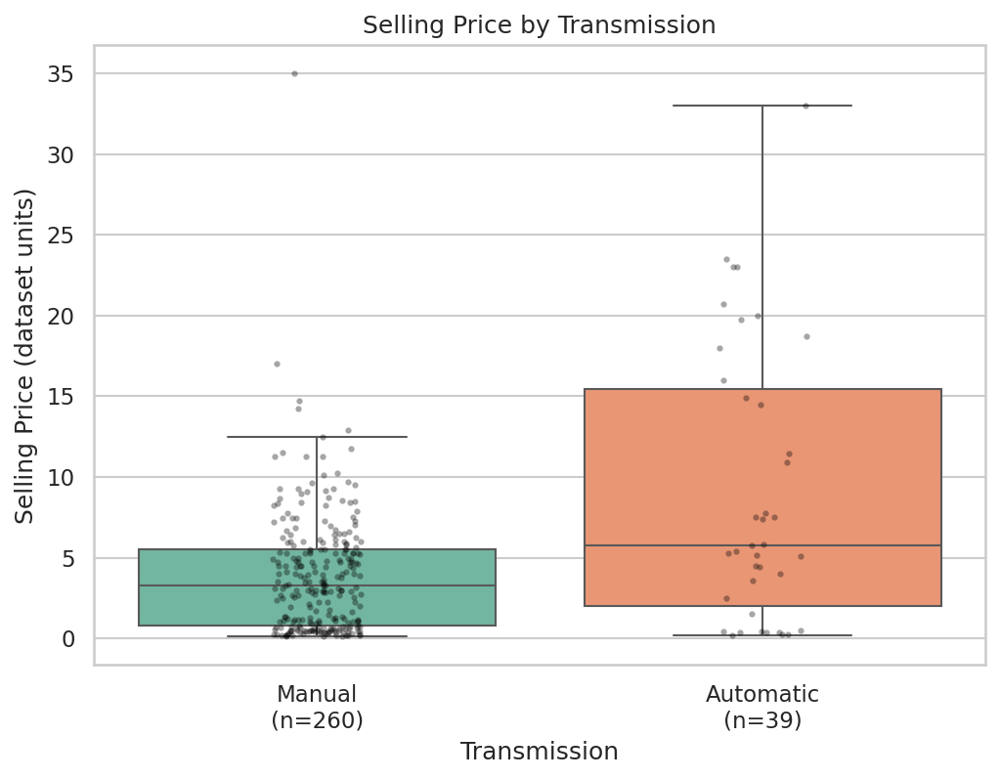 |
| 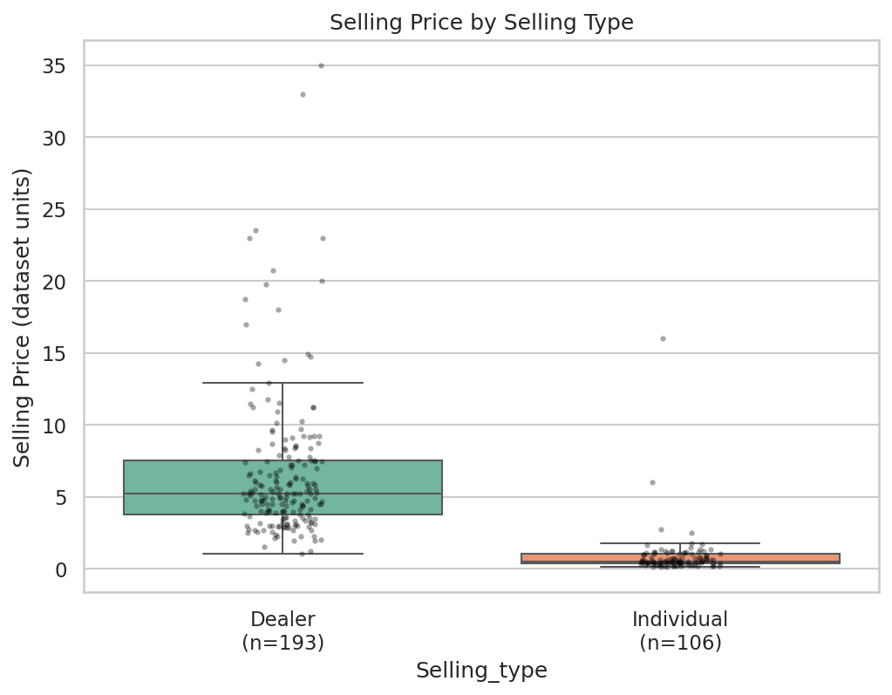 | 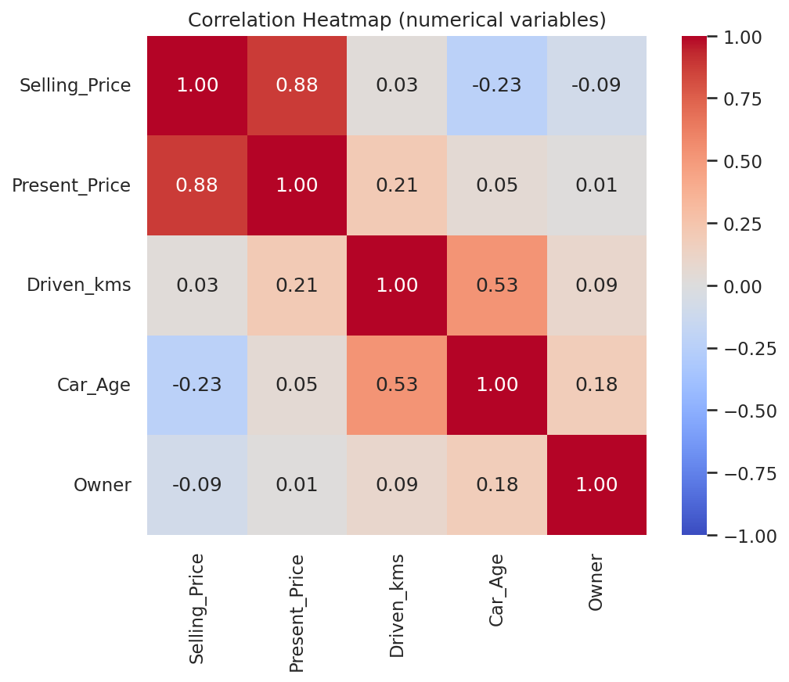 |
| 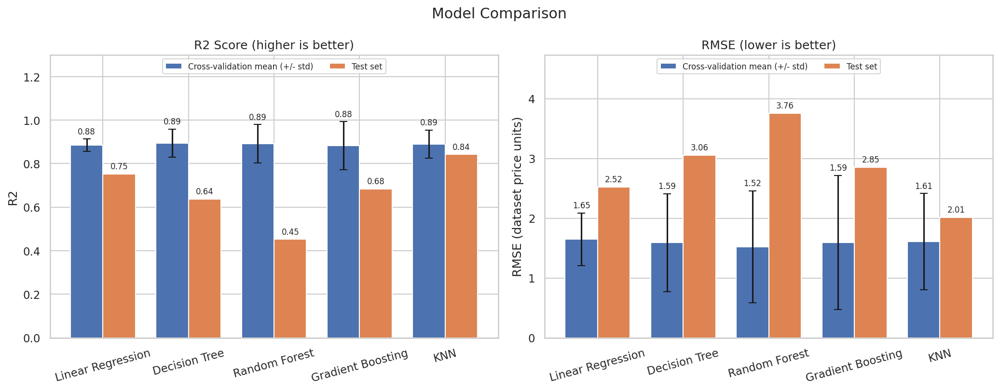 | 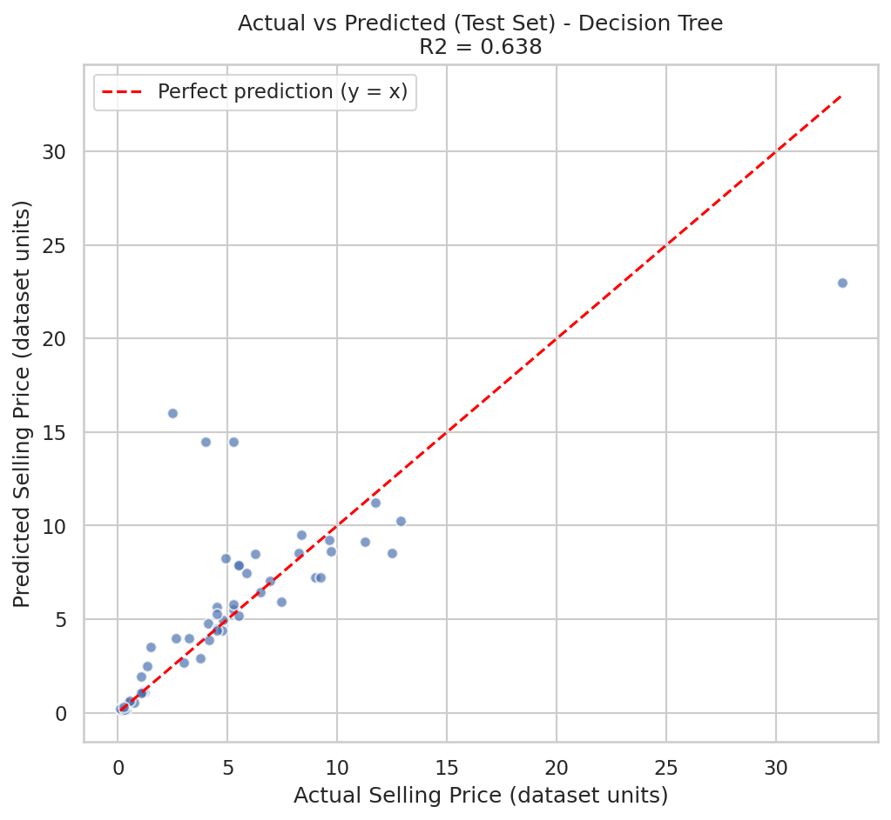 |
| 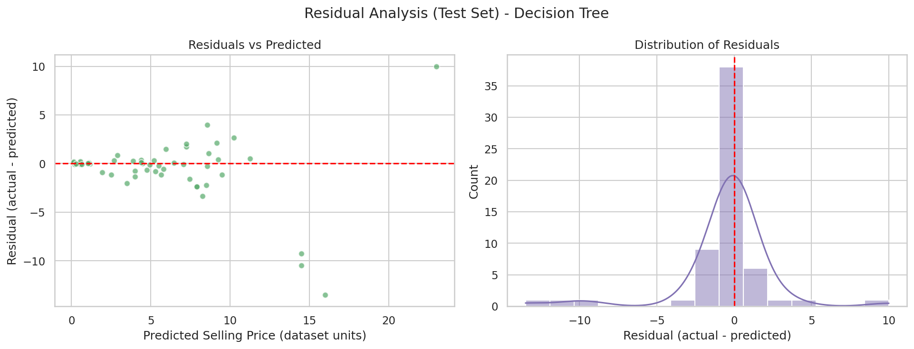 | 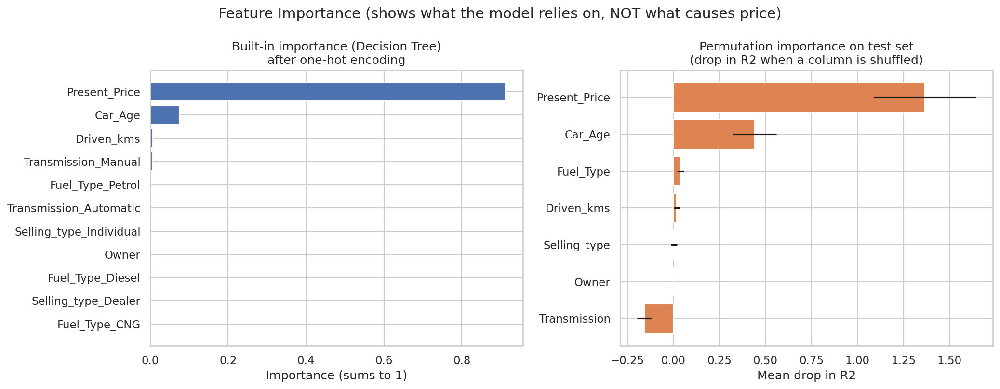 |

Charts 01–08 are EDA; 09 compares models; 10 shows actual vs predicted prices for the final model (points on the dashed line are perfect); 11 shows residuals (actual − predicted); 12 shows feature importance.

## 18. Key Findings

1. `Present_Price` is by far the strongest predictor of `Selling_Price` in this data.
2. `Car_Age` adds useful information; `Driven_kms` and `Owner` add very little.
3. All five models reach a cross-validated R² of roughly 0.88–0.89, so no model is clearly better on the training data.
4. Test scores are much more spread out (0.45–0.84) because the test set is small and contains a few unusual vehicles.
5. Tree-based models overfit the training data (training R² ≥ 0.98).
6. The file mixes cars and motorcycles/scooters, and `Selling_type` mostly separates the two – results must be interpreted with this in mind.

## 19. Limitations

- Only 299 rows after cleaning; the test set has just 60 rows, so a single split gives a noisy estimate.
- Historical data (2003–2018) – the model does not know current market prices.
- Price units are not stated in the file.
- Contains 101 motorcycles/scooters, so it is not a pure car dataset.
- Tiny groups (2 CNG vehicles, 11 vehicles with Owner > 0, 39 automatics) cannot be learned reliably.
- Missing real-world factors: city, variant/trim, condition, accident and service history.
- `Car_Name` was not used; no hyperparameter tuning was done.
- Correlation and feature importance show association, not causation.

## 20. How to Run

```bash
# 1. Clone the repository
git clone https://github.com/dhinas751-cmyk/CodeAlpha_Car_Price_Prediction.git
cd CodeAlpha_Car_Price_Prediction

# 2. (Optional) create a virtual environment
python -m venv .venv
# Windows: .venv\Scripts\activate      macOS/Linux: source .venv/bin/activate

# 3. Install dependencies
pip install -r requirements.txt

# 4. Run the project
python src/car_price_prediction.py
```

The script regenerates all charts in `outputs/images/`, plus `outputs/results.txt` and `outputs/model_comparison.csv`.

## 21. Internship Information

- **Program:** CodeAlpha Virtual Data Science Internship
- **Task:** Task 3 – Car Price Prediction
- **Author:** Dhina · GitHub: [dhinas751-cmyk](https://github.com/dhinas751-cmyk)

## 22. Conclusion

This project walks through a full regression workflow on a small real dataset: careful cleaning (duplicates removed with a stated reason), a dataset-consistent `Car_Age` feature, EDA, leak-free Pipelines, five compared models, cross-validation and honest test evaluation. The main lesson is that `Present_Price` and `Car_Age` drive the predictions, but with ~300 rows, the results are noisy and the models are hard to separate. More data, a cleaner separation of cars and two-wheelers, and hyperparameter tuning would be the next steps.
